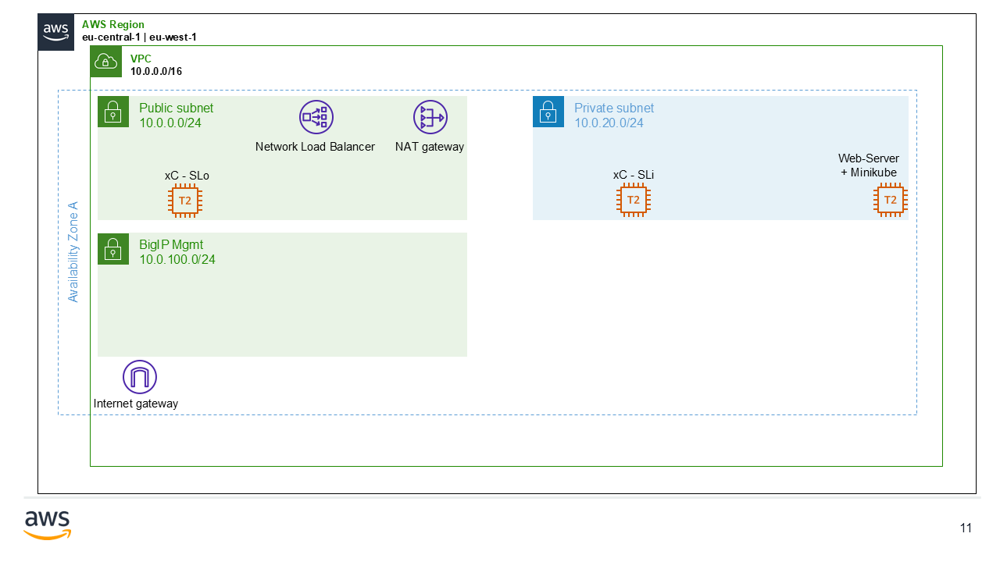

[Use Cases]: xC-use-cases/README.md
[BigIP - eu-central]: https://bigip-mgmt-eu-central-1.de1chk1nd-lab.aws 
[BigIP - eu-west]: https://bigip-mgmt-eu-west-1.de1chk1nd-lab.aws 

# xC-mcn-demo - Lab Introduction & Set Up
Welcome to my lab. This lab contains many f5 xC app solution & use cases. Pre-Configured and prepared to be build in AWS just within a couple of minutes.

The installation is failry simple and based on a local python script to deploy the whole infrastructure.

&nbsp;

The lab set up uses two public- and one privat subnets. By default we are going to set up a basic insfrastrucure in two different AWS regions: **eu-central-1** and **eu-west-1**.

- Dual-Homed (SLo and SLi) xc Customer Edge
- BigIP Best
- Ubuntu Server with Docker and minikube

&nbsp;



&nbsp;

---

## xC-mcn-demo - Installation
Download the repository and "cd" into the root ***xC-mcn-demo*** lab.
```shell
py ./setup-init/initialize_infrastructure.py
```

&nbsp;

### Post Install
Links to AWS "remote-reachable" devices (***CAUTION:*** Some devices are tied to client's public IP address)

&nbsp;

> __**ATTENTION:**__ Before you can access the AWS Devices, please add local /etc/hosts entries - see next sub-chapter for details.

&nbsp;

| Device                    	 		 | Username | Password (lab-default)  |
|:---------------------------------------|:---------|:------------------------|
| [BigIP - eu-central]  				 | admin    | REDACTED_P12_PASSWORD         |
| [BigIP - eu-west]       				 | admin    | REDACTED_P12_PASSWORD         |

&nbsp;

#### <span style="color:blue">**Windows**</span>
```shell

code "C:/Windows/System32/drivers/etc/hosts"
terraform -chdir="./infrastructure" output -raw etc-hosts | Set-Clipboard
```

&nbsp;

```shell

del $Env:userprofile\.ssh\known_hosts
powershell.exe -File "$Env:userprofile\Documents\git-repositories\xC-mcn-demo\setup-init\.ssh\ssh-key-permission_win.ps1"
```

&nbsp;

#### <span style="color:red">**Linux**</span>
```shell

terraform -chdir="./infrastructure" output -raw etc-hosts | xclip -sel clip
x-terminal-emulator -e 'sudo vim /etc/hosts'
```

&nbsp;

```shell

rm ~/.ssh/known_hosts
sudo ./setup-init/.ssh/ssh-key-permission_lnx.sh
```

&nbsp;

---

### xC-mcn-demo - Delete
#### <span style="color:blue">**Windows**</span>
```shell

$Env:VES_P12_PASSWORD="REDACTED_P12_PASSWORD"
terraform -chdir="./infrastructure" destroy -auto-approve
```

&nbsp;

#### <span style="color:red">**Linux**</span>
- **optional** If AWS credentials expired, update creds in ./setup-init/config.yaml and run **cred-aws.py** script
```shell
py ./setup-init/cred-aws.py
```

&nbsp;
- Delete infrastrucure in AWS and within xC Console

```shell

export VES_P12_PASSWORD='REDACTED_P12_PASSWORD'
terraform -chdir="./infrastructure" destroy -auto-approve
```

&nbsp;
- manually delete local hosts entry

```shell
sudo vim /etc/hosts
```