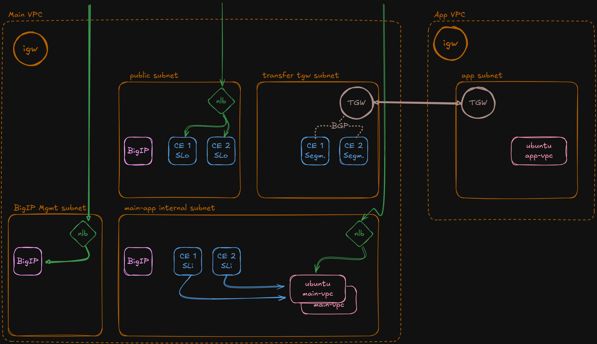

# xC-mcn-demo - Lab Introduction & Set Up

[GitHub - MCN repository]: https://github.com/de1chk1nd/xC-mcn-demo
[BigIP - eu-central]: https://bigip-mgmt-eu-central-1.<student>.xc-mcn-lab.aws
[BigIP - eu-west]: https://bigip-mgmt-eu-west-1.<student>.xc-mcn-lab.aws

Welcome to my lab. This lab contains many F5 Distributed Cloud (xC) application solutions and use cases. Pre-configured and prepared to be built in AWS within a couple of minutes.

The installation is fairly simple and based on a local Python script to deploy the whole infrastructure.

> **ATTENTION:** The full HTML Lab Guide lives at **[docs/lab-guide/index.html](docs/lab-guide/index.html)**.
> It includes Quick Start, Detailed Setup, and all Use Case steps in one place.

> For prerequisites, tool installation instructions, repository structure, and step-by-step setup, see the **[Installation & Setup Guide](docs/install-and-setup.md)**.

&nbsp;

---

## Overview of AWS Demo Environment

This diagram illustrates a demo setup in AWS featuring **F5 Distributed Cloud Customer Edge (CE)** nodes. The environment is divided into a **Main VPC** and an **App VPC**, interconnected via a **Transit Gateway (TGW)**.

&nbsp;

### Components

- **Customer Edge (CE)**:
  - Deployed in both the public subnet and transfer TGW subnet.
  - Supports routing and connectivity testing.
  - Uses **BGP** to communicate with the App VPC.

- **Ubuntu Servers**:
  - Host application workloads.
  - Deployed in both the Main VPC (`ubuntu main-vpc`) and the App VPC (`ubuntu app-vpc`).
  - Accessible either locally (direct CE-to-Ubuntu communication) or remotely via BGP routing.

- **BigIP Appliances**:
  - One instance is used for **management** in a dedicated subnet.
  - Another instance supports **local traffic routing** between CE nodes and the application server.

- **Network Load Balancers (NLBs)**:
  - Distribute incoming traffic to CE nodes and BigIP instances across different subnets.

&nbsp;

### Key Use Cases

- Local traffic from CE nodes to the application in the Main VPC.
- Remote application access from CE nodes to the App VPC using BGP over the Transit Gateway.
- Routing through the local BigIP to reach the Ubuntu application server.
- ***For a complete list of use cases please check:*** [xC Use Cases](xC-use-cases/README.md)

&nbsp;

This architecture showcases flexible traffic routing, high availability, and hybrid connectivity use cases using F5 Distributed Cloud and AWS components.

The servers are accompanied by AWS services such as **NLB**, **Route 53** (private hosted zone), and **NAT Gateway**.

&nbsp;

> **Note:** For simplicity, all components in this demo environment are deployed within a **single Availability Zone**.

&nbsp;

***Overview:***

&nbsp;

---

## Getting Started

The Quick Start, Detailed Setup, and Teardown steps live in the HTML Lab Guide.

- **Lab Guide (HTML):** `docs/lab-guide/index.html`
- **Setup Guide (Markdown):** `docs/install-and-setup.md`

Use the Lab Guide as the primary workflow. The README stays as a project overview.

---

## Tools

The `tools/` directory contains standalone utilities for the lab environment:

| Tool | Purpose |
|:-----|:--------|
| **[s-certificate](tools/s-certificate/)** | Generate CA-signed server/client certificates, optional upload to xC |

See [tools/README.md](tools/README.md) for details and conventions.

&nbsp;

---

## Documentation

| Document | Description |
|:---------|:------------|
| **[Installation & Setup Guide](docs/install-and-setup.md)** | Prerequisites, tool installation, repository structure, detailed setup |
| **[xC Use Cases](xC-use-cases/README.md)** | All available use cases with setup/delete scripts |
| **[Tools Overview](tools/README.md)** | Standalone utilities and tool conventions |
| **[Contributing](CONTRIBUTING.md)** | How to contribute to this project |
| **[Security Policy](SECURITY.md)** | Reporting vulnerabilities, credential handling |
| **[License](LICENSE)** | MIT License |
