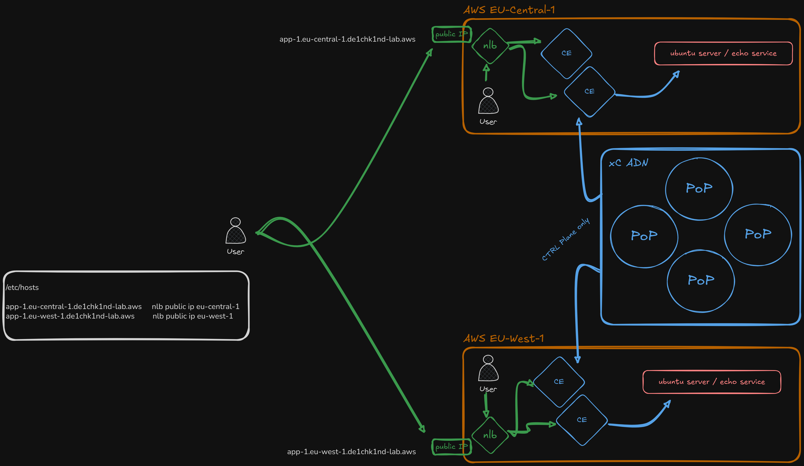

# North-South: CE via Cloud Load Balancer

Create HTTPS load balancers **advertised directly on the Customer Edge (CE)** rather than on the Regional Edge. An AWS Network Load Balancer (NLB) in each region forwards external traffic to the CE node. A default Web Application Firewall policy is attached, providing SaaS-managed WAAP at the edge.

> **Lab Guide:** [Open in Lab Guide](../../../docs/lab-guide/index.html#ns-ce-clb)

## Technical Overview

Pure API automation — generates two CA-signed server certificates, uploads them to xC, then creates two HTTP load balancers with `advertise_custom` on CE virtual sites (`SITE_NETWORK_OUTSIDE`). The CE binds the FQDN to its local interface; the NLB NATs external traffic to the CE IP.

Internal hosts in the same VPC can also reach the LB directly (DNS resolves to CE private IP via Route53), so the same WAF policy protects both external and internal traffic.

### API Endpoints

| Method | Endpoint | Object |
|--------|----------|--------|
| POST | `/api/config/namespaces/{ns}/certificates` | `tls-{student}-app-ce-eu-central-1` |
| POST | `/api/config/namespaces/{ns}/certificates` | `tls-{student}-app-ce-eu-west-1` |
| POST | `/api/config/namespaces/{ns}/http_loadbalancers` | `lb-ce-central` |
| POST | `/api/config/namespaces/{ns}/http_loadbalancers` | `lb-ce-west` |
| DELETE | (reverse order) | All of the above |

### Script Flow — setup.sh

1. Load config via `common-config-loader.sh`
2. Ensure `s-certificate` tool config exists
3. Loop over 2 domains: generate cert → base64 encode → upload to xC
4. Render 2 LB templates via `envsubst`
5. Create 2 HTTP load balancers (advertised on CE virtual sites)

### Script Flow — delete.sh

1. Delete 2 HTTP load balancers
2. Delete 2 certificates from xC
3. Remove local PEM files, generated payloads, and s-certificate config

### Infrastructure Dependencies

- AWS NLB with listener on TCP/443 forwarding to CE public ENI
- Route53 private hosted zone: `app-ce-eu-central-1.<domain>` and `app-ce-eu-west-1.<domain>` → CE private IP
- `/etc/hosts` on laptop: same FQDNs → NLB public IP (for external access)

## Files

| Path | Type | Description |
|------|------|-------------|
| `bin/setup.sh` | Permanent | Automated deployment script |
| `bin/delete.sh` | Permanent | Automated teardown script |
| `etc/__template_lb-ce-eu-central.json` | Permanent | LB template — eu-central (advertised on CE) |
| `etc/__template_lb-ce-eu-west.json` | Permanent | LB template — eu-west (advertised on CE) |
| `payload_final_*.json` | Temporary | Generated payloads (gitignored) |
| `setup-init/.cert/domains/app-ce-eu-*.{cert,key}` | Temporary | Generated PEM files (gitignored) |
