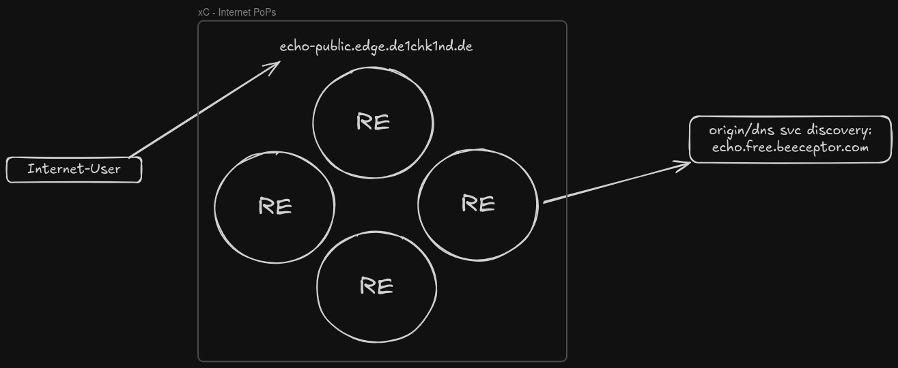

# North-South: RE Only

Create an HTTP load balancer with ingress and egress via **Regional Edge (RE)**. Egress goes directly via the Internet using DNS service discovery (FQDN) of AWS NLB names across EU-Central-1 and EU-West-1. A default Web Application Firewall policy is attached.

> **Lab Guide:** [Open in Lab Guide](../../../docs/lab-guide/index.html#ns-re)

## Technical Overview

The setup script is pure API automation — no SSH or Terraform involved (except reading NLB DNS names from Terraform outputs). It generates a CA-signed server certificate, uploads it to xC, then creates an origin pool and HTTP load balancer.

### API Endpoints

| Method | Endpoint | Object |
|--------|----------|--------|
| POST | `/api/config/namespaces/{ns}/certificates` | `tls-{student}-echo-public` |
| POST | `/api/config/namespaces/{ns}/origin_pools` | `origin-public-echo-aws` |
| POST | `/api/config/namespaces/{ns}/http_loadbalancers` | `lb-echo-public` |
| DELETE | (reverse order) | All of the above |

### Script Flow — setup.sh

1. Load config via `common-config-loader.sh`
2. Fetch Terraform outputs: NLB DNS names for eu-central-1 and eu-west-1
3. Ensure `s-certificate` tool config exists (copy `.example` if missing)
4. Generate server certificate via `s-certificate --no-p12 --keep-pem`
5. Base64-encode cert + key, upload to xC via certificates API
6. Render origin pool and LB templates via `envsubst`
7. Create origin pool → create HTTP load balancer

### Script Flow — delete.sh

1. Delete HTTP load balancer
2. Delete origin pool
3. Delete certificate from xC
4. Remove local PEM files and generated payloads

## Files

| Path | Type | Description |
|------|------|-------------|
| `bin/setup.sh` | Permanent | Automated deployment script |
| `bin/delete.sh` | Permanent | Automated teardown script |
| `etc/__template__origin-pool.json` | Permanent | Origin pool template (NLB DNS from Terraform) |
| `etc/__template_http-loadbalancer.json` | Permanent | HTTP LB template with `tls_cert_params` |
| `payload_final_*.json` | Temporary | Generated payloads (gitignored) |
| `setup-init/.cert/domains/echo-public.*.{cert,key}` | Temporary | Generated PEM files (gitignored) |
