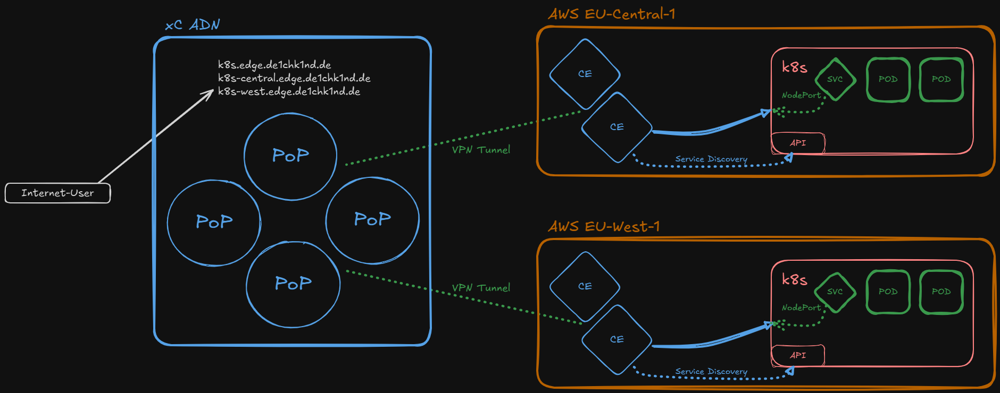

# k8s Service Discovery

Create **Kubernetes service discovery** objects for minikube clusters running on CE sites. The script SSHs into each Ubuntu server, fetches the kubeconfig, deploys an echo application, and registers service discovery objects, origin pools, and HTTPS load balancers with the xC API. A default Web Application Firewall policy is attached.

> **Lab Guide:** [Open in Lab Guide](../../../docs/lab-guide/index.html#sd-k8s)

## Technical Overview

This is the most complex use case — it combines SSH access, Kubernetes operations, certificate generation, and multiple xC API calls. The script SSHs into Ubuntu servers to fetch kubeconfigs and deploy the echo app, then registers everything with the xC API.

### API Endpoints

| Method | Endpoint | Object |
|--------|----------|--------|
| POST | `/api/config/namespaces/{ns}/certificates` | `tls-{student}-k8s` |
| POST | `/api/config/namespaces/{ns}/certificates` | `tls-{student}-k8s-central` |
| POST | `/api/config/namespaces/{ns}/certificates` | `tls-{student}-k8s-west` |
| POST | `/api/config/namespaces/{ns}/discoverys` | `sd-k8s-{student}-eu-central` |
| POST | `/api/config/namespaces/{ns}/discoverys` | `sd-k8s-{student}-eu-west` |
| POST | `/api/config/namespaces/{ns}/origin_pools` | `origin-k8s-central` |
| POST | `/api/config/namespaces/{ns}/origin_pools` | `origin-k8s-west` |
| POST | `/api/config/namespaces/{ns}/http_loadbalancers` | `lb-k8s` |
| POST | `/api/config/namespaces/{ns}/http_loadbalancers` | `lb-k8s-central` |
| POST | `/api/config/namespaces/{ns}/http_loadbalancers` | `lb-k8s-west` |
| DELETE | (reverse order) | All of the above |

### Script Flow — setup.sh

1. Load config via `common-config-loader.sh`
2. Ensure `s-certificate` tool config exists
3. SSH to eu-central Ubuntu: fetch kubeconfig + deploy echo app
4. SSH to eu-west Ubuntu: fetch kubeconfig + deploy echo app
5. Base64-encode kubeconfigs into environment variables
6. Loop over 3 domains: generate cert → base64 encode → upload to xC
7. Render all templates via `envsubst` (SD, origin pools, LBs)
8. Create 2 service discovery objects → 2 origin pools → 3 HTTP load balancers

### Script Flow — delete.sh

1. Delete 3 HTTP load balancers
2. Delete 2 origin pools
3. Delete 2 service discovery objects
4. Delete 3 certificates from xC
5. Remove kubeconfig files, generated payloads, local PEM files, and s-certificate config

### SSH Details

SSH uses `-o StrictHostKeyChecking=no -o UserKnownHostsFile=/dev/null -o LogLevel=ERROR` to avoid `known_hosts` pollution. The kubeconfig is fetched via `sudo kubectl config view --flatten` and the echo app is deployed via `sudo kubectl apply`.

## Files

| Path | Type | Description |
|------|------|-------------|
| `bin/setup.sh` | Permanent | Automated deployment script |
| `bin/delete.sh` | Permanent | Automated teardown script |
| `etc/__template_sd_eu-central.json` | Permanent | Service discovery template (eu-central) |
| `etc/__template_sd_eu-west.json` | Permanent | Service discovery template (eu-west) |
| `etc/__template_origin_eu-central.json` | Permanent | Origin pool template (eu-central) |
| `etc/__template_origin_eu-west.json` | Permanent | Origin pool template (eu-west) |
| `etc/__template_lb-k8s.json` | Permanent | LB template — both regions |
| `etc/__template_lb-k8s-central.json` | Permanent | LB template — eu-central only |
| `etc/__template_lb-k8s-west.json` | Permanent | LB template — eu-west only |
| `etc/kubeconfig-eu-central` | Temporary | Fetched kubeconfig (gitignored) |
| `etc/kubeconfig-eu-west` | Temporary | Fetched kubeconfig (gitignored) |
| `payload_final_*.json` | Temporary | Generated payloads (gitignored) |
| `setup-init/.cert/domains/k8s*.{cert,key}` | Temporary | Generated PEM files (gitignored) |
