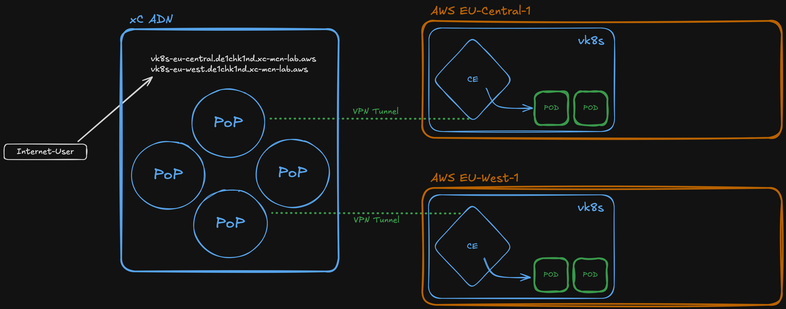

# Edge Computing: vk8s

Deploy container workloads to CE sites using F5 xC **virtual Kubernetes (vk8s)**. Pods run directly on Customer Edge nodes without requiring a separate Kubernetes cluster. A default Web Application Firewall policy is attached to each load balancer.

> **Lab Guide:** [Open in Lab Guide](../../../docs/lab-guide/index.html#vk8s)

## Technical Overview

Pure API automation — creates a vk8s cluster, deploys a workload, and sets up origin pools and HTTPS load balancers. The vk8s cluster is created via the xC API (no Terraform dependency). Terraform outputs from the base infrastructure are used to resolve CE site names.

### API Endpoints

| Method | Endpoint | Object |
|--------|----------|--------|
| POST | `/api/config/namespaces/{ns}/certificates` | `tls-{student}-vk8s-eu-central` |
| POST | `/api/config/namespaces/{ns}/certificates` | `tls-{student}-vk8s-eu-west` |
| POST | `/api/config/namespaces/{ns}/virtual_k8ss` | `{student}-vk8s` |
| POST | `/api/config/namespaces/{ns}/workloads` | `echo-aws` |
| POST | `/api/config/namespaces/{ns}/origin_pools` | `origin-vk8s-eu-central` |
| POST | `/api/config/namespaces/{ns}/origin_pools` | `origin-vk8s-eu-west` |
| POST | `/api/config/namespaces/{ns}/http_loadbalancers` | `lb-vk8s-eu-central` |
| POST | `/api/config/namespaces/{ns}/http_loadbalancers` | `lb-vk8s-eu-west` |
| DELETE | (reverse order) | All of the above |

### Script Flow — setup.sh

1. Load config via `common-config-loader.sh`
2. Ensure `s-certificate` tool config exists
3. Fetch Terraform outputs: CE site names (GW01 for each region)
4. Loop over 2 domains: generate cert → base64 encode → upload to xC
5. Render all templates via `envsubst` (vk8s cluster, workload, origin pools, LBs)
6. Create vk8s cluster → deploy workload → create 2 origin pools → create 2 HTTP load balancers

### Script Flow — delete.sh

1. Delete 2 HTTP load balancers
2. Delete 2 origin pools
3. Delete workload (`echo-aws`)
4. Delete vk8s cluster (`{student}-vk8s`)
5. Delete 2 certificates from xC
6. Remove generated payloads, local PEM files, and s-certificate config

## Files

| Path | Type | Description |
|------|------|-------------|
| `bin/setup.sh` | Permanent | Automated deployment script |
| `bin/delete.sh` | Permanent | Automated teardown script |
| `etc/__template_vk8s-cluster.json` | Permanent | vk8s cluster template |
| `etc/__template_workload.json` | Permanent | Workload template (echo-aws) |
| `etc/__template_origin-vk8s-eu-central.json` | Permanent | Origin pool template (eu-central) |
| `etc/__template_origin-vk8s-eu-west.json` | Permanent | Origin pool template (eu-west) |
| `etc/__template_lb-vk8s-eu-central.json` | Permanent | LB template — eu-central |
| `etc/__template_lb-vk8s-eu-west.json` | Permanent | LB template — eu-west |
| `payload_final_*.json` | Temporary | Generated payloads (gitignored) |
| `setup-init/.cert/domains/vk8s-eu-*.{cert,key}` | Temporary | Generated PEM files (gitignored) |
