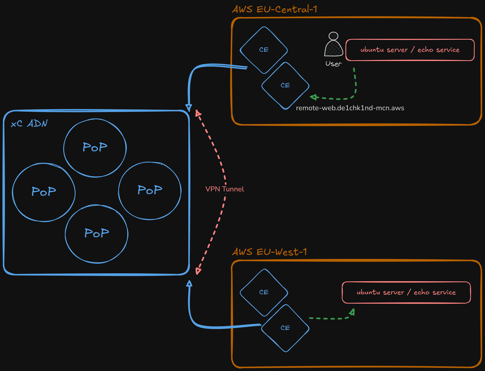

# East-West Loadbalancer - CE to CE

Create HTTP load balancers for east-west traffic between **Customer Edge (CE)** sites. Each region gets an internal load balancer that routes to the origin pool in the **opposite** region, enabling cross-site connectivity. A default **Web Application Firewall** policy is attached to each load balancer.



## Prerequisites

- `setup-init/config.yaml` configured with valid XC credentials
- PEM certificate generated (run `python3 setup-init/initialize_infrastructure.py`)
- Infrastructure deployed (`terraform apply` in `infrastructure/`)
- Origin pools `origin-nginx-aws-eu-central-1` and `origin-nginx-aws-eu-west-1` must exist (created by infrastructure Terraform)
- `yq`, `envsubst`, and `curl` installed

## Deploy

```bash
"./xC-use-cases/East-West Loadbalancer - CE to CE/bin/setup.sh"
```

This script will:
1. Generate load balancer payloads from templates
2. Create HTTP load balancer `lb-api-int-west` (advertised on eu-west CE sites)
3. Create HTTP load balancer `lb-api-int-central` (advertised on eu-central CE sites)

## Test Access

This test validates **multi-cloud networking (MCN)** -- traffic enters a CE in one AWS region and is routed across the F5 Distributed Cloud global network to a web server behind a CE in a **different** AWS region. 

The two regions have no direct VPC peering; connectivity is provided entirely by the xC fabric.

> **Traffic flow:**
>
> | You SSH into... | You curl `remote-web` | LB routes to... | Response from... |
> |---|---|---|---|
> | 🟢 **EU-Central-1** web server | → `lb-api-int-central` | → origin in **EU-West-1** | 🔴 **EU-West-1** NGINX |
> | 🔴 **EU-West-1** web server | → `lb-api-int-west` | → origin in **EU-Central-1** | 🟢 **EU-Central-1** NGINX |

&nbsp;

1. SSH to a web server

```bash
"./xC-use-cases/East-West Loadbalancer - CE to CE/bin/ssh-webservers.sh" central
"./xC-use-cases/East-West Loadbalancer - CE to CE/bin/ssh-webservers.sh" west
"./xC-use-cases/East-West Loadbalancer - CE to CE/bin/ssh-webservers.sh" both
```

2. Test east-west connectivity

From the SSH session, curl the internal load balancer. The **Server name** in the response should be from the **opposite** region:

```bash
curl --silent http://remote-web.de1chk1nd-mcn.aws | grep "Server name"
```

3. Test WAF protection

The attached WAF policy blocks malicious requests. This should return a **403 Forbidden** or reset:

```bash
curl --silent "http://remote-web.de1chk1nd-mcn.aws?a=<script>"
```

&nbsp;

## Delete

```bash
"./xC-use-cases/East-West Loadbalancer - CE to CE/bin/delete.sh"
```

This script will:
1. Delete both HTTP load balancers
2. Clean up generated payload files

## Configuration

All credentials and tenant settings are loaded from `setup-init/config.yaml` via the shared config loader. No passwords are hardcoded in the scripts.

### Files

| Path | Description |
|------|-------------|
| `bin/setup.sh` | Automated deployment script |
| `bin/delete.sh` | Automated teardown script |
| `bin/ssh-webservers.sh` | SSH helper to connect to web servers |
| `etc/__template_ew_loadbalancing-eu-central.json` | LB template -- advertised on eu-central |
| `etc/__template_ew_loadbalancing-eu-west.json` | LB template -- advertised on eu-west |
