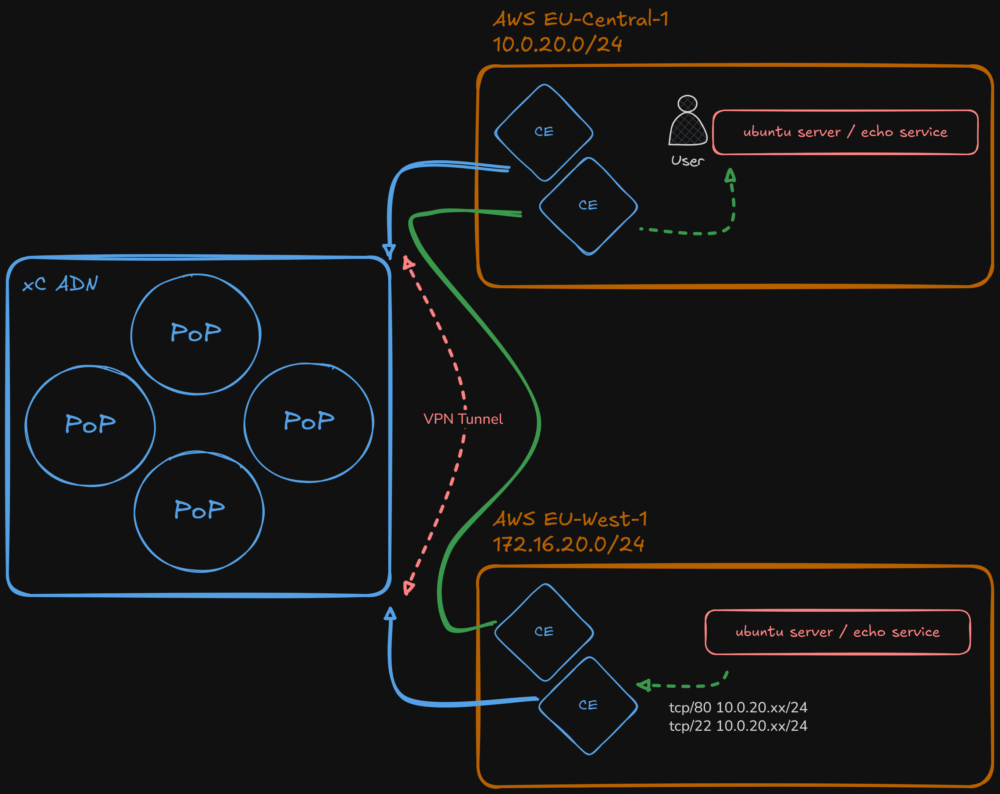
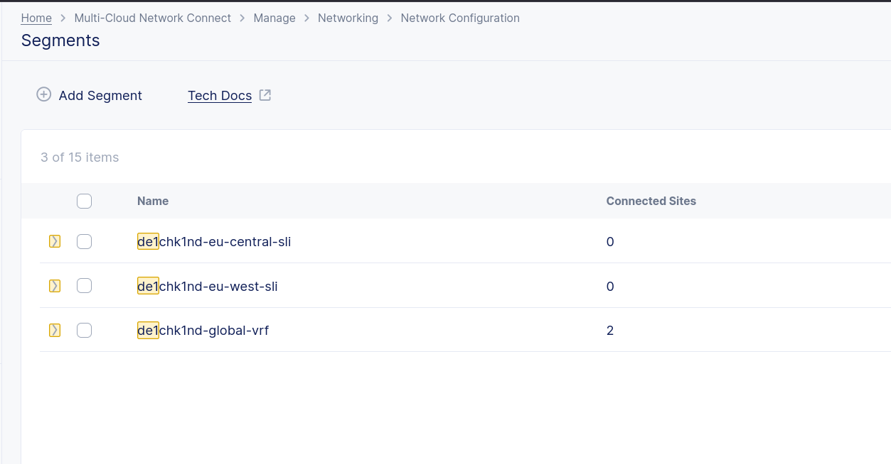
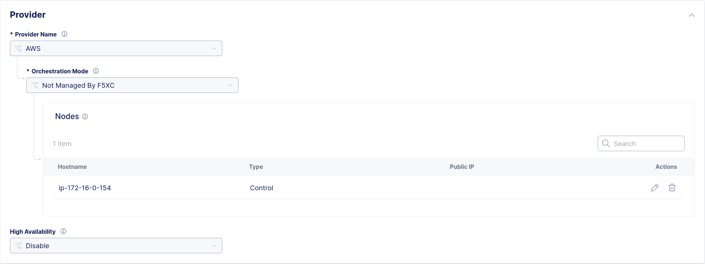
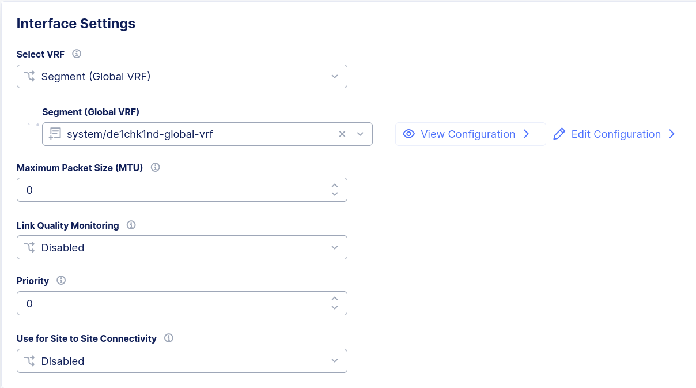
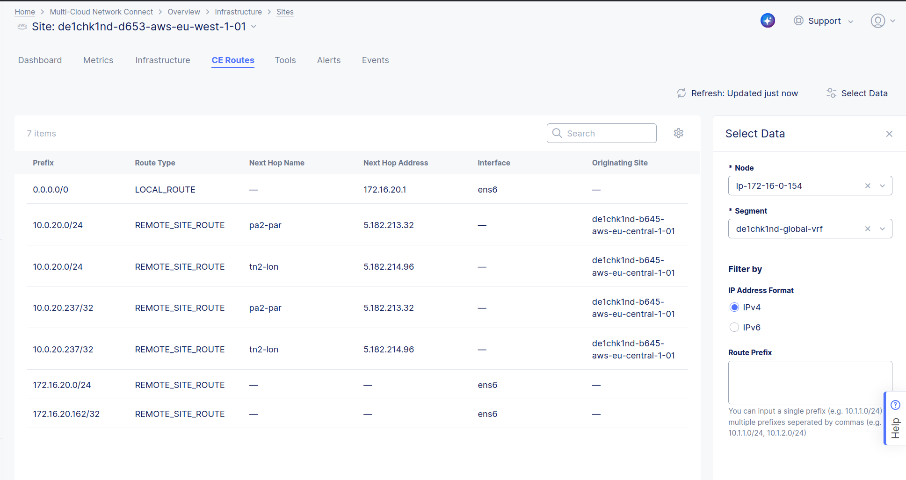

# Demo for xC East-West Loadbalancer - full VPN Tunnel (Network Connect)
This Demo will establish a **full L3 VPN Tunnel** betwenn both AWS Sites.
In SMSv2 this is done by creating segments. For this use case, ONE global Segment will be used (ease of use).

> This lab seciton is in beta - Routing only possible via **GW01 to GW01** CE Nodes

&nbsp;

***Overview:***

&nbsp;

## Create / Configure Segments
1. Create a Segment. For this lab we are going to use existing ***de1chk1nd-global-vrf***
&nbsp;

&nbsp;

2. Go to **Home >> Multi-Cloud Network Connect >> Manage >> Site Management >> Customer Edges >> 'YOUR CUSTOMER EDGE' >> Manage** and select your Host within the "Provider" Section
&nbsp;

&nbsp;

3. Go to Interface "ens6" and change **Select VRF** from ***SITE LOCAL INSIDE*** to ***Segment (Global VRF)*** and choose the above Segment from the Drop Down menu. Do this for both GW01 (eu-west and eu-central)

&nbsp;

&nbsp;

4. Check CE Routes

&nbsp;

&nbsp;

5. Test Access

&nbsp;

6. (optional) Adjust Pool (from inside to new segment)

&nbsp;

## Delete / Remove Segments
1. Change Interface Setting back to "SITE_LOCAL_INSIDE"