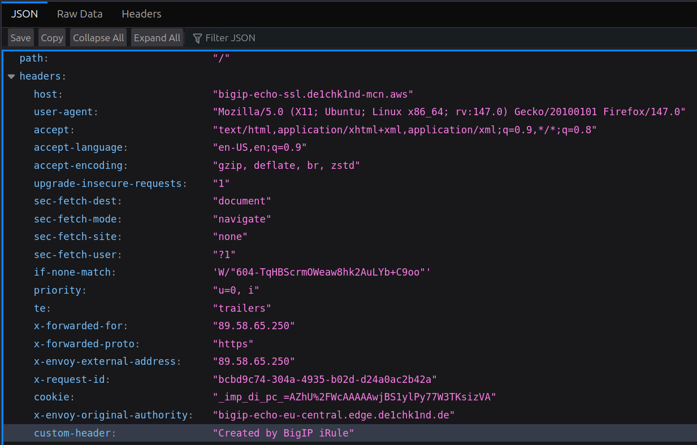
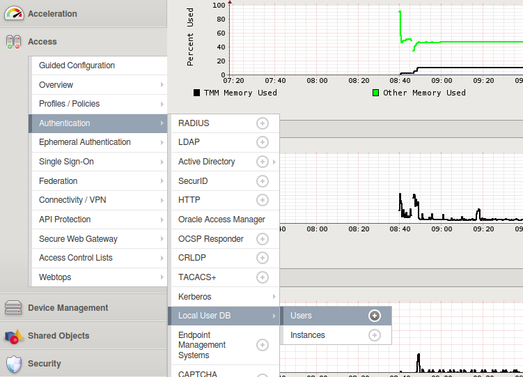
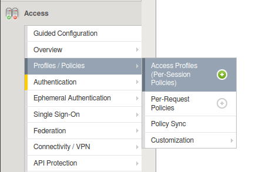
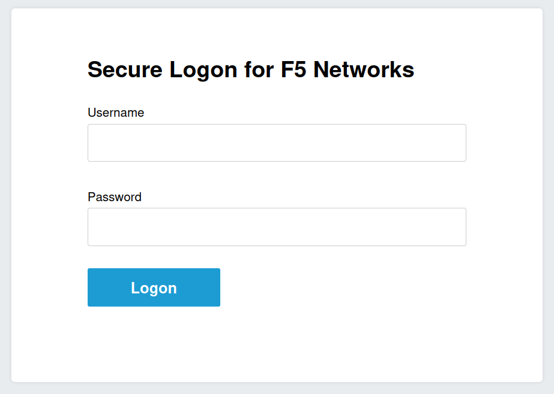

# Demo for xC North-South Loadbalancer - RE to CE via local BigIP

[BigIP - eu-central]: https://bigip-mgmt-eu-central-1.de1chk1nd-lab.aws
[BigIP - eu-west]: https://bigip-mgmt-eu-west-1.de1chk1nd-lab.aws

This Demo will create three HTTP Lodbalancer via API to build ingress RE and egress CE on AWS HTTP Loadbalancer - forwarding traffic to local BigIP w/o Service Discovery.

A ***Wep Application Firewall*** default policy will be attached to each HTTP  Loadbalancer.

&nbsp;

***Overview:***


&nbsp;

## Create Loadbalancer

```shell

"xC-use-cases/North-South Loadbalancer - RE to CE on big-ip/bin/setup.sh"
```

&nbsp;

## Test / Verify

- ***Access to BigIP from external (check/add config manually):***

    | Device                                 | Username | Password (lab-default)  |
    |:---------------------------------------|:---------|:------------------------|
    | [BigIP - eu-central]                   | admin    | DefaultLabPwd!2026      |
    | [BigIP - eu-west]                      | admin    | DefaultLabPwd!2026      |

    > **ATTENTION:** Before you can access the AWS Devices, please add local /etc/hosts entries!

&nbsp;

- Check for Header: ***custom-header***

  

&nbsp;

- ***optional***: create APM policy with local auth
  - FQDN: ***bigip-echo-eu-central.edge.de1chk1nd.de***

  - login to **eu-central bigip** and create local user db:

    
  - Instance
    - name: local-user-db
    - all other settings are default
  - Create new user
    - User Name: alice
    - Password: \<CHOOSE_PASSWORD\>
    - Instance: /Common/local-user-db
  - Create Access Profile:

    
    - name: local-auth
    - profile type: All
    - Languages: English
  - Edit profile:
    - Start > Login Page > Authentication (LocalDB Auth; LocalDB Instance: /Common/local-auth) > Allow
    - Apply Access Policy
  - Change Partition to: xcmcnlab
  - Assign Policy to Virtual Server "echo443tlspass"
- After "refreshing" bwowser / accessing ***bigip-echo-eu-central.edge.de1chk1nd.de*** again, a auth pop up should appear.
  
  

&nbsp;

## Delete Loadbalancer

```shell

"xC-use-cases/North-South Loadbalancer - RE to CE on big-ip/bin/delete.sh"
```
