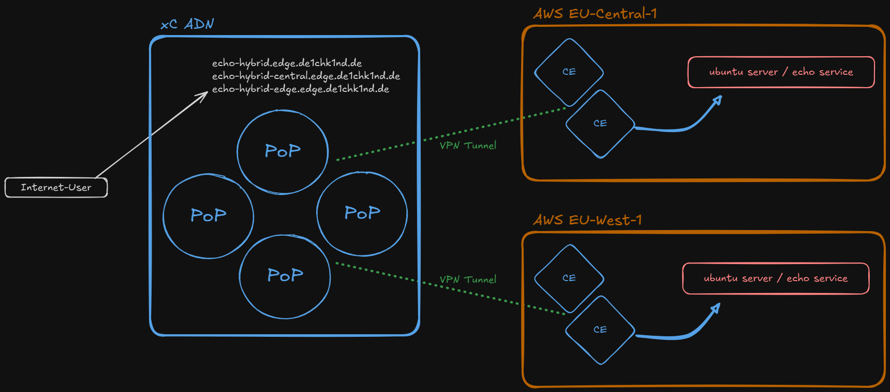

# North-South Loadbalancer - RE to CE

Create HTTP load balancers with ingress via **Regional Edge (RE)** and egress via **Customer Edge (CE)** on AWS. Three load balancers are deployed: 
- a combined LB routing to both regions,
- and one dedicated LB per region (eu-central, eu-west).

A default **Web Application Firewall** policy is attached to each load balancer.



## Prerequisites

- `setup-init/config.yaml` configured with valid XC credentials
- PEM certificate generated (run `python3 setup-init/initialize_infrastructure.py`)
- Infrastructure deployed (`terraform apply` in `infrastructure/`)
- Origin pools `origin-docker-echossl-aws-eu-central-1` and `origin-docker-echossl-aws-eu-west-1` must exist (created by infrastructure Terraform)
- `yq`, `envsubst`, and `curl` installed

## Deploy

```bash
"./xC-use-cases/North-South Loadbalancer - RE to CE/bin/setup.sh"
```

This script will:
1. Generate load balancer payloads from templates
2. Create HTTP load balancer `lb-echo-hybrid` (both regions)
3. Create HTTP load balancer `lb-echo-hybrid-central` (eu-central only)
4. Create HTTP load balancer `lb-echo-hybrid-west` (eu-west only)

## Test

Test appliaction access and verify "hostname" in json response:
- Loadbalancing between web-01 and web-02 via local / regional FQDNs.
- Loadbalancing between web-01 and web-02 accross **both** regions.


## Delete

```bash
"./xC-use-cases/North-South Loadbalancer - RE to CE/bin/delete.sh"
```

This script will:
1. Delete all three HTTP load balancers
2. Clean up generated payload files

## Configuration

All credentials and tenant settings are loaded from `setup-init/config.yaml` via the shared config loader. No passwords are hardcoded in the scripts.

### Files

| Path | Description |
|------|-------------|
| `bin/setup.sh` | Automated deployment script |
| `bin/delete.sh` | Automated teardown script |
| `etc/__template_lb-echo-ssl.json` | LB template -- both regions |
| `etc/__template_lb-echo-ssl-central.json` | LB template -- eu-central only |
| `etc/__template_lb-echo-ssl-west.json` | LB template -- eu-west only |
